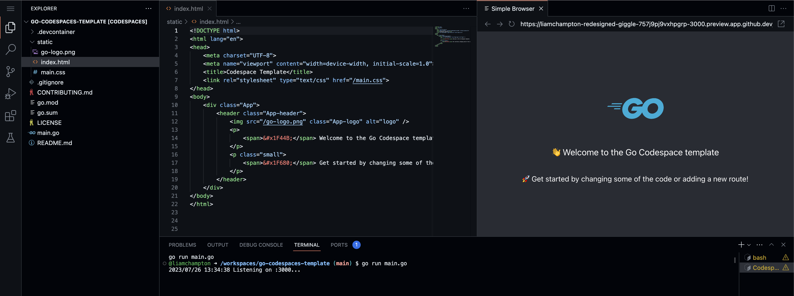
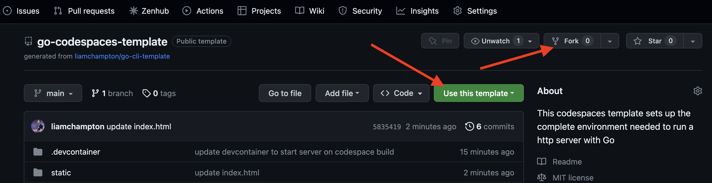
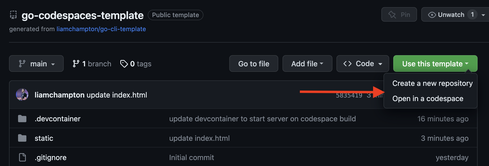
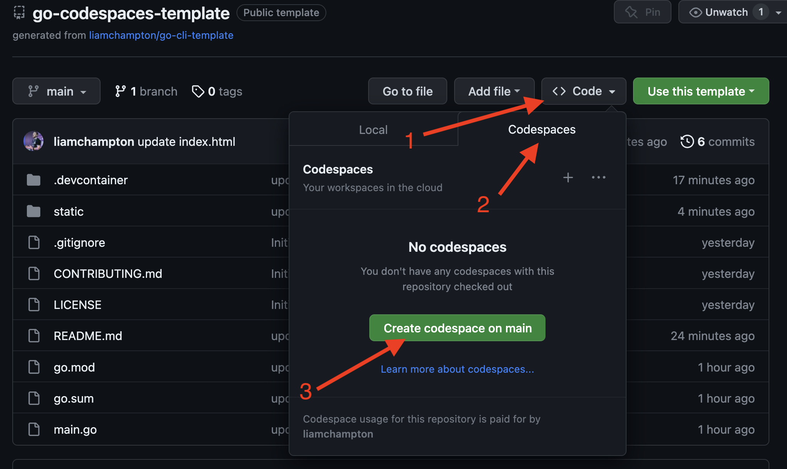
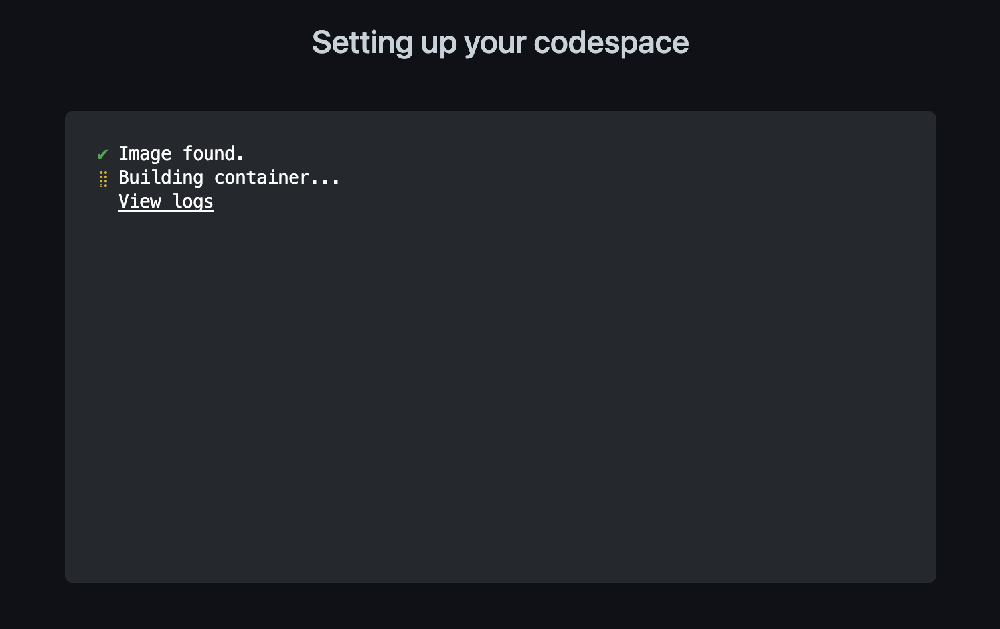
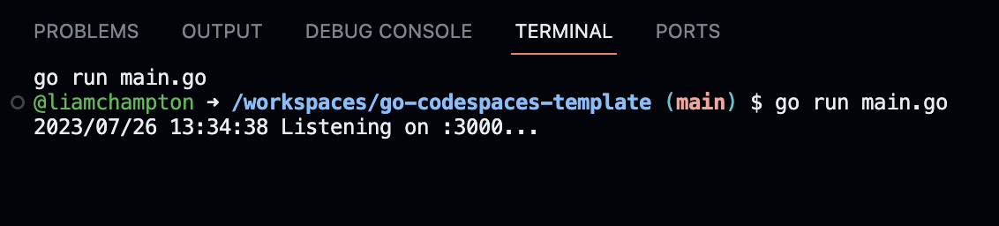

# go-codespaces-template
This is a template that is designed to be used with GitHub Codespaces to get you up and running with your Go server projects in a matter of minutes.



## Getting started

To get started, first you need to decide if you want to `fork` or `template` this repository. In simple terms, with a fork you will have a copy of this repository in your own GitHub account and you can make changes to it as you wish, as well as the ability to pull any updates made from this top level template repository. With a template, you will have a copy of this repository in your own GitHub account as it stands in its current form. You will be able to make changes to the code and make the project your own, but you will not be able to push those changes back to this template repository.

### Forking / Templating



### Creating a codespace

Once you have your own copy of this repository, you can create a codespace by clicking the green `Code` button and selecting `New Codespace` or simply use the template button as shown below.



OR



Once you have chosen your method, you will be presented with a creating codespace screen that looks like this:



Wait for this to finish and you will be presented with a screen that looks like VSCode, but in your browser.

Once this has opened you will also notice a terminal popup at the bottom of the editor. You need to wait just a moment longer for the post create command to finish setting up the environment for you. You will know this is done when you see the following in the terminal:



This has been setup in the `.devcontainer.json` as a post create command so you can turn this off if you like.

Once the setup has completed, your environment will be split in two, with some code on the left and the webpage on the right. You are ready to start coding!


## Running out of the box

Now the server is running, if you modify the HTML files you can see the change appear without needing to restart the server but rather by reloading the webpage on the right hand side of the editor.

If you change any `.go` files within the repository you will need to reload the server. To do this, navigate to the terminal where the server is running and press `CTRL/control + C` and then run the command `go run main.go`.

## Building a binary

When you are happy with your project, you can build a binary of the application using the following commands:

```bash
go build
./go-codespaces-template
```

To change the name of the built binary, you can add the `-o` flag to the build command. For example: `go build -o test-binary`.

## Contributing

If you wish to contribute, please read the [contributing guide](./CONTRIBUTING.md) included and please obide by the [License](./LICENSE) when using this template.
